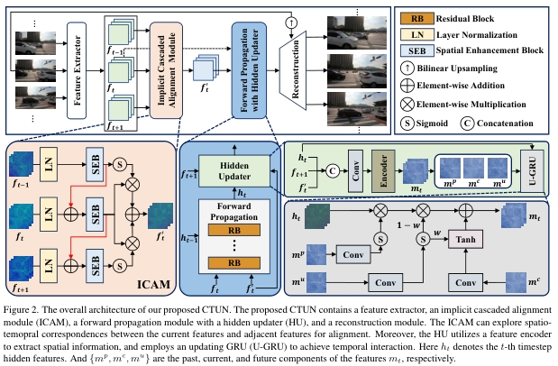
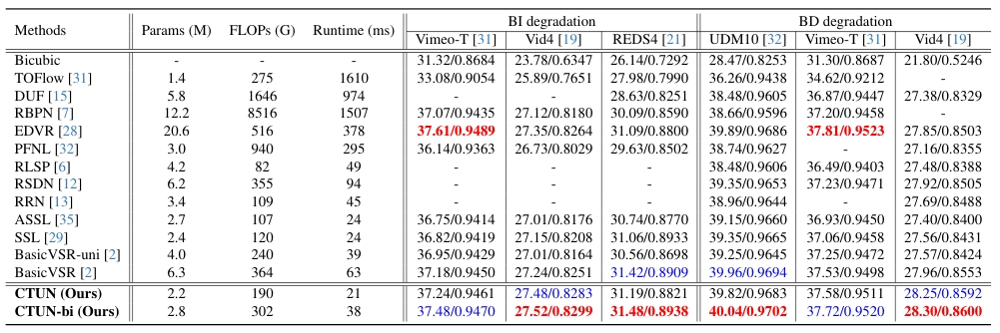
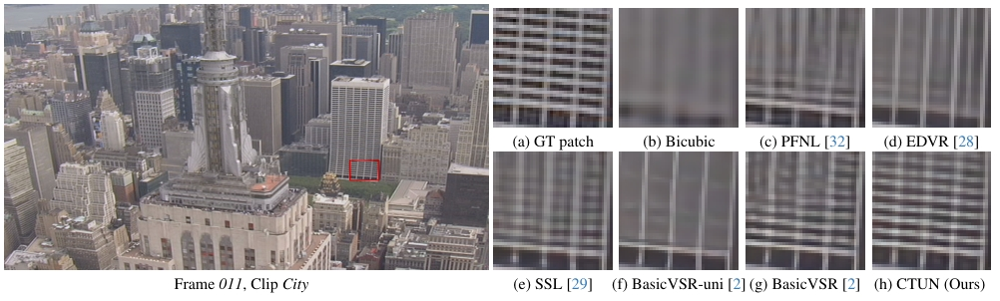

### Cascaded Temporal Updating Network for Efficient Video Super-Resolution
[](https://github.com/House-Leo/CTUN)
> [[Paper (arxiv)](https://arxiv.org/abs/2408.14244)] &emsp; [[Project Page](https://github.com/House-Leo/CTUN)]

> [Hao Li](https://house-leo.github.io/), [Jiangxin Dong](https://scholar.google.com/citations?user=ruebFVEAAAAJ&hl=zh-CN&oi=ao), [Jinshan Pan](https://jspan.github.io/) <br>
> [IMAG Lab](https://imag-njust.net/), Nanjing University of Science and Technology

---
<p align="center">
  
</p>

*Existing video super-resolution (VSR) methods generally adopt a recurrent propagation network to extract spatio-temporal information from video sequences, exhibiting impressive performance. However, the key components in recurrent-based models significantly impact model efficiency, e.g., the alignment module occupies a substantial portion of model parameters, while the bidirectional propagation mechanism significantly amplifies the inference time. Consequently, developing a compact and efficient VSR method remains challenging. To this end, we propose a cascaded temporal updating network (CTUN) for efficient VSR.  We first develop an implicit cascaded alignment module to explore spatio-temporal correspondences from adjacent frames. Moreover, we propose a unidirectional propagation updating network to efficiently explore long-range temporal information, which is crucial for high-quality video reconstruction. Specifically, we develop a simple yet effective hidden updater that can leverage future information to update hidden features during forward propagation, significantly reducing running time while maintaining performance. Extensive experimental results show that our CTUN achieves a favorable trade-off between efficiency and performance compared to existing methods. Notably, compared with BasicVSR, our method obtains better results while employing only about 30\% of the parameters and running time..*

---
### News
- [2025-03-03] Release testing code and pre-trained models for Vid4 (BI).

### To do
- [ ] Release training code

### How to evaluate
- **Requirements**
  - Python 3.8
  - PyTorch 1.13
- **Installation**
  ```bash
  pip install -r requirements.txt
  python setup.py develop
  ```
- **Run the following command to test the model**
  ```bash
  bash test.sh
  ```


### Results
- **Quantitative Results**


- **Qualitative Results**


### Citation
If this work is helpful for your research, please consider citing the following BibTeX entry.
```
@article{li2024ctun,
    title={Cascaded Temporal Updating Network for Efficient Video Super-Resolution},
    author={Li, Hao and Dong, Jiangxin and Tang, Jinhui and Pan, Jinshan},
    journal={arXiv preprint arXiv:2408.14244},
    year={2024}
 }
 ```

### Acknowledgement
The README template is borrowed from [SAFMN](https://github.com/sunny2109/SAFMN). Thanks for the awesome work.

### Contact
If you have any questions, please feel free to reach me out at <a href="mailto:haoli@njust.edu.cn">haoli@njust.edu.cn</a>.
